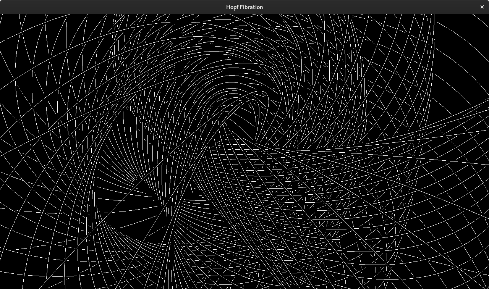
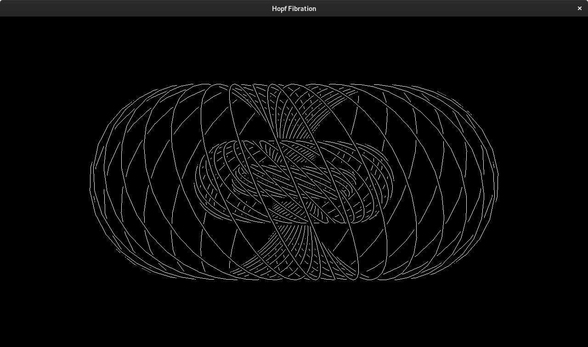
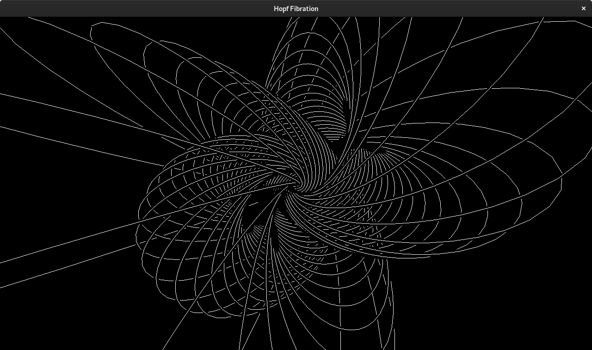

# hopf-fibration

Generate images of the hopf fibration.

## Usage

Hold keys `Q`, `W`, `E`, `A`, `S`, `D` to select from the six planes of rotation, and use the scroll wheel to rotate the fibration through the selected plane. The resulting Hopf links are stereographically projected into 3D space, and the resulting circles are rendered orthographically on screen. 

Hold left-control `LCTL` and scroll to zoom in on the fibration. This affects only the orthographic rendering, not the fibration itself.

---

## More information

[Wikipedia: Hopf Fibration](https://en.wikipedia.org/wiki/Hopf_fibration)
